# SNMP-ON-UBUNTU
在ubuntu系统中部署SNMP协议以及实践SNMP
# SNMP网管协议实践

## 总体思路

1、因windows系统下有些不方便操作，因此下载了virtual box虚拟机仿真平台，克隆了两台搭载Ubuntu系统的Linux设备，一台充当SNMP Manager，一台充当SNMP Agent，进行SNMP网络监控和管理实验。

2、创建一个两台虚拟机共用的局域网，分别给两台虚拟机赋予同一网段的IP地址。两台机器互ping，可以接通。

3、安装SNMP守护程序和实用程序。

Manager安装：snmp和snmp-mibs-downloader。snmp软件包提供了用于向代理发出SNMP请求的命令行工具集合。该snmp-mibs-downloader软件包将帮助安装和管理管理信息库（MIB）文件，该文件可跟踪网络对象。

Agent安装：snmpd，作为被管理设备。

4、配置SNMP管理器服务器，配置SNMP代理服务器（创建用户，开放161端口）。

5、验证代理服务器的身份，进行测试以确保可以使用manager连接到代理服务器。

6、设置普通用户帐户。使用引导程序用户作为新用户的模板。

7、创建客户端配置文件。与步骤6中的普通用户对应，从而manager更方便输入管控命令。

8、经过上述步骤配置完成，使用SNMP进行通信。包括：获取系统所有的信息、取得系统总内存、取得IP信息、取得系统用户数、查看系统信息、获取网卡信息、获取本地设备等信息。同时，可进行SNMP命令翻译。可进行节点地域分配记录。

9、可删除临时创建的用户。

## 分步进行

1、创建虚拟机，分配manager和AGENT系统。

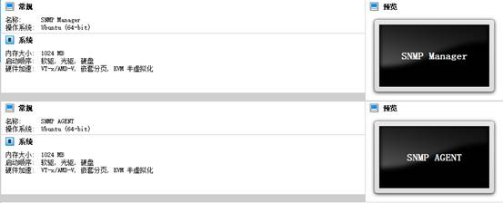

2、设置manager和agent的ip地址，manager：10.0.0.20，agent：10.0.0.10.互ping联通。

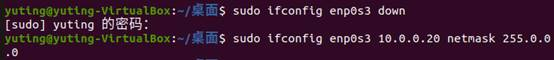

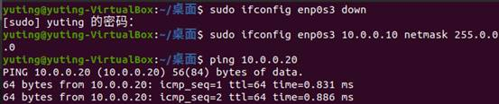

3、省略安装snmp和snmpd包的步骤。

4、验证代理服务器的身份，二者可以连通。

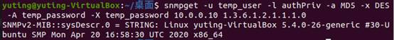

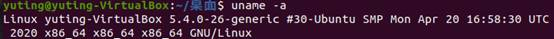

5、设置普通用户帐户、密码。

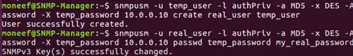

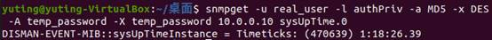

6、创建客户端配置文件，简化身份验证详细信息。需要输入SNMP命令，主机和命令参数即可获得信息。

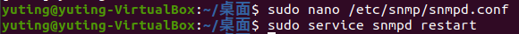

7、删除临时用户。

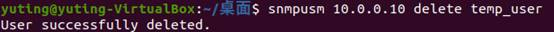

8、使用SNMP进行通信。包括：获取系统所有的信息、取得系统总内存、取得IP信息等。

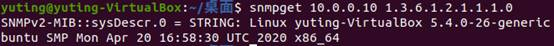

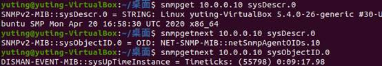

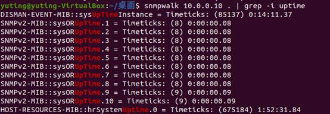

9、SNMP命令翻译。

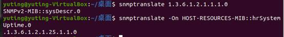
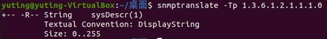

10、设置AGENT地区区域，方便管理。

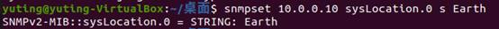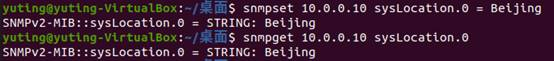

10、使用SNMP BULK请求与网络实体通信。获得系统所有信息。

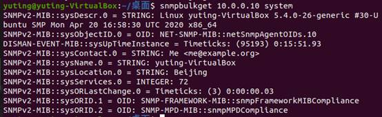
## 一些SNMP命令实践

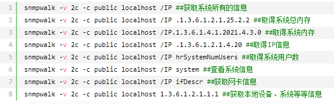

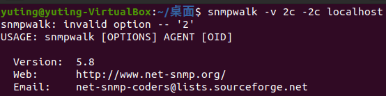

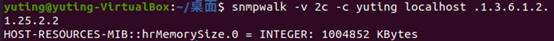

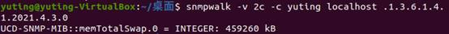

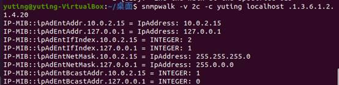

